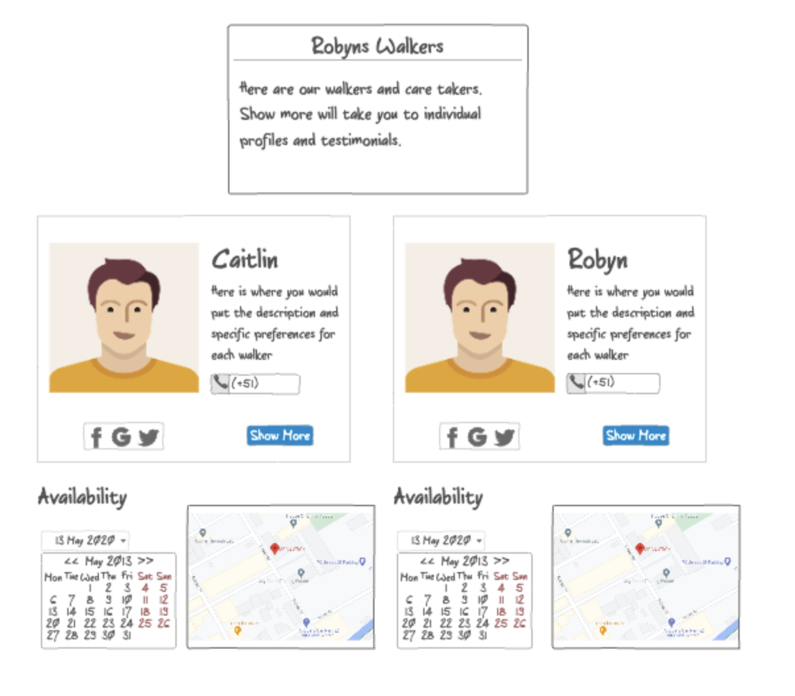

# startup
Startup application for CS260

# Elevator Pitch:

People often regard pets as part of their family. But when they are unable to take care of them or when they travel what should you do with your pets? Dog Watchers is a service to get people to walk, care, watch, love your pets as you would. We take care of your dogs as if they were our family. Don't let your pets get lonely!

## Design:

Simple UI for the main dashboard page:

### Key features

- Secure login over HTTPS
- Ability to view walker profiles
- Display of profiles, and locations
- Ability to schedule, and contact
- Displays calender and schedules in real time
- Ability for a user to lock in their appointment
- Ability for admin to create and delete appointments

### Technologies

I am going to use the required technologies in the following ways.

- **HTML** - Uses correct HTML structure for application. Three HTML pages. One for home/dashboard and one for profiles/testimonials and one for scheduling. Hyperlinks to choice artifact.
- **CSS** - Application styling that looks good on different screen sizes, uses good whitespace, color choice and contrast.
- **JavaScript** - Provides login, profile display, scheduling, display other appointments, display locations and service areas, backend endpoint calls.
- **Service** - Backend service with endpoints for:
  - login
  - retrieving appointments
  - submitting appointment requests
  - retrieving schedule
- **DB/Login** - Store users, schedules, and profiles in database. Register and login users. Credentials securely stored in database. Can't schedule unless authenticated.
- **WebSocket** - As each user creates appointments, their schedules are broadcast to all other users.
- **React** - Application ported to use the React web framework.

**HTML Startup**
Added 4 files Index, Calender, References, and about that cover the basic HTML structure of the startup. Eventually I will replace the calender with database info corresponding to each individual walker, as well I will use web socket to allow clients to schedule and leave reviews for each walker.

## CSS Deliverable 

[x] - done - Prerequisite: Simon CSS deployed to your production environment
[x] - done - Prerequisite: A link to your GitHub startup repository prominently displayed on your application's home page
[x] - done - Prerequisite: Notes in your startup Git repository README.md file
[x] - done - 30% Header, footer, and main content body. Used flex to layout sections.
[x] - done - 20% Navigation elements. Links highlight on hover.
[x] - done - 10% Responsive to window resizing. Looks great on iPad, desktop, and iPhone.
[x] - done - 20% Application elements. Buttons are using bootstrap
[x] - done - 10% Application text content. Text is displayed using the Merriday font
[x] - done - 10% Application images. I added curved edges around my profile photo.